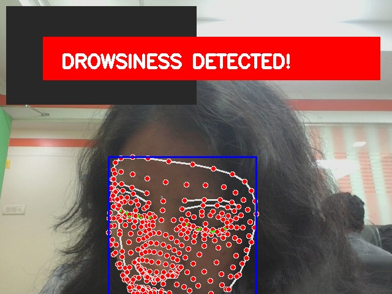
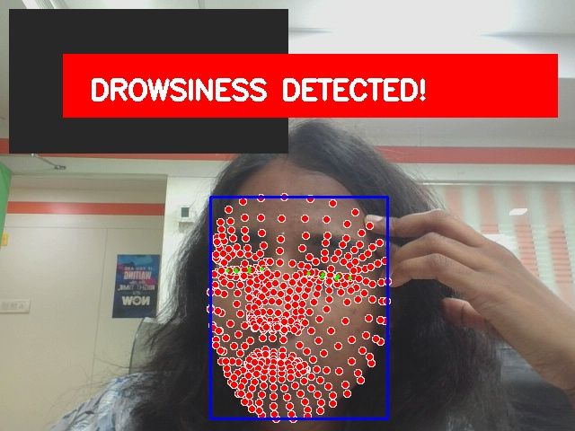

# Real-Time Driver Drowsiness Detection System

## Overview

This project is a real-time AI-based Driver Drowsiness Detection System developed using Python, OpenCV, and MediaPipe Face Mesh.

The system monitors eye movements through webcam input and detects drowsiness using Eye Aspect Ratio (EAR) calculations. If the driver's eyes remain closed for too long, the system triggers a visual warning and alarm alert.

---

## Features

- Real-time webcam monitoring
- Eye tracking using MediaPipe Face Mesh
- Eye Aspect Ratio (EAR) calculation
- Drowsiness detection alert
- Alarm sound warning
- Blink counter
- Fatigue timer
- FPS counter
- Screenshot capture
- Face bounding box
- Live eye landmark visualization

---

## Technologies Used

- Python
- OpenCV
- MediaPipe
- NumPy
- Pygame
- SciPy

---

## Project Structure

```bash
driver-drowsiness-detection/
│
├── app.py
├── config.py
├── requirements.txt
├── alarm.wav
│
├── screenshots/
├── logs/
│
├── utils/
│   ├── ear.py
│   ├── visualization.py
│   └── __init__.py
```

---

## Installation

Clone the repository:

```bash
git clone https://github.com/vedikasarayu-22/driver-drowsiness-detection.git
```

Install dependencies:

```bash
pip install -r requirements.txt
```

Run the project:

```bash
python app.py
```

---

## How It Works

1. Webcam captures live video feed
2. MediaPipe detects facial landmarks
3. Eye landmarks are extracted
4. EAR (Eye Aspect Ratio) is calculated
5. If EAR remains below threshold:
   - Drowsiness alert appears
   - Alarm sound plays
   - Screenshot gets saved
   - Event gets logged

---

## Screenshots

### Eye Tracking



### Drowsiness Alert



---

## Future Enhancements

- Head pose estimation
- Mobile camera support
- Streamlit dashboard
- Email/SMS alerts
- Driver analytics dashboard

---

## Author

Vedika Sarayu
